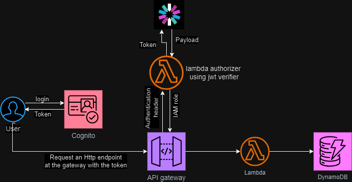

# Testing the endpoints in our rest API

Here we use jest to carryout an acceptance test which checks the integration between AWS services used in the architecture.

In the notes.test.js file we obtain the authentication token and await the result of calling we_invoke_createNote() function. In the when.js file we_invoke_createNote() will call the makeHttpRequest() function which sends an http request to an API endpoint ( In the 'create notes' case, the path will be /notes ). The API gateway 
will then inturn invoke the lambda function - createNotes to process the request.

## What are the resources used in this architecture?

Cognito

API Gateway

Lambda

DynamoDB

IAM

The Diagram below shows the architecture.

